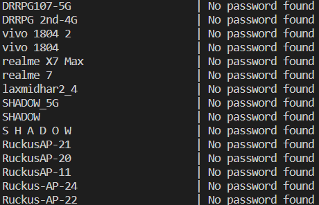

# WiFi Password

Retrieve saved WiFi profiles and their respective passwords from a Windows system.

## Details

This script uses built-in Python modules and does not rely on external dependencies. The main modules utilized are:

- `subprocess`: To execute the `netsh` command-line utility.
- `platform`: To ensure the script is run on Windows systems only.

## Features

- Fetch all saved WiFi profiles on your Windows system.
- Retrieve passwords for each WiFi profile.
- Display results in a readable format.

## Getting Started

### Prerequisites

- Python (3.x recommended)
- Windows OS (as the script uses `netsh`)
- Administrative privileges to execute the script

## How to Use

1. Clone the repository to your local machine.
2. Open Command Prompt as Administrator.
3. Navigate to the directory containing the script.
4. Run the script using `python Wifi_Password.py`.
## Screenshots

## Contributions

Contributions are welcome! If you see an opportunity for improvement, please open an issue or submit a pull request. Make sure your contributions are well-documented.

## License

This project is licensed under the MIT License - see the [LICENSE.md](LICENSE.md) file for details.

## Acknowledgements

- Thanks to Google and the Youtube for guidance and support.
- All contributors who have or will pitch in to refine this script.